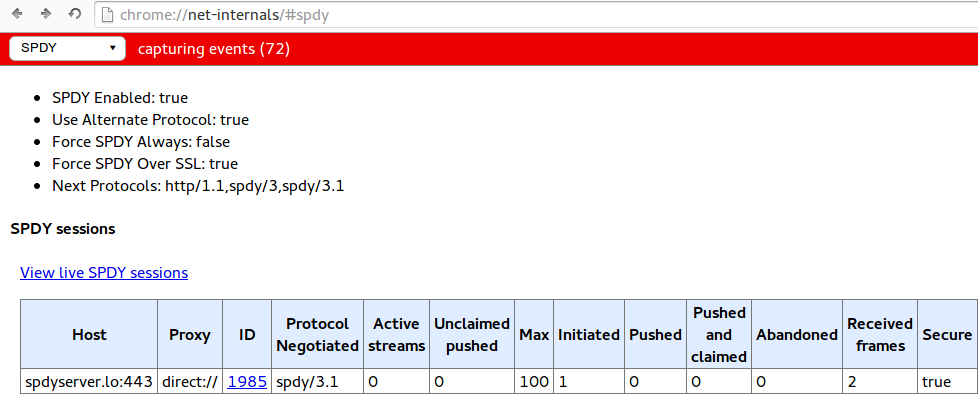

# Introducción

SPDY es un protocolo de nivel de sesión complementario a HTTP que busca reducir el tiempo de carga de páginas web. Esto se consigue maximizando el rendimiento de HTTP mediante una reducción del número de conexiones TCP necesarias, permitiendo manejar distintas peticiones HTTP de forma concurrente. 

SPDY consigue un aumento de seguridad al incorporar TLS como capa subyacente. Además, SPDY reduce las cabeceras para mejorar la velocidad de transmisión y reducir el envío de datos. 

# Problemas de HTTP
Con el surgimiento de las aplicaciones web y el cambio de comportamiento
de los usuarios en Internet, que ahora pasan cada vez más tiempo conectados,
salen a relucir algunos problemas que presenta HTTP para manejar los 
intercambios de información:

## Conexiones
Utilizar HTTP implica abrir un gran número de conexiones TCP entre
cliente y servidor para obtener los objetos y recursos de una web.
La persistencia que aporta HTTP1.1 no es suficiente, ya que 
generalmente un *timeout* en el servidor cierra la conexión.

## Solicitudes
HTTP está diseñado para que el cliente haga siempre las peticiones
necesarias. Sin embargo, obtener un recurso suele implicar solicitar
algunos recursos secundarios, para los que son necesarias nuevas
peticiones. Además, en las aplicaciones web son muchas las 
ocasiones en las que no se conoce el momento en que se obtendrán
nuevos datos desde el servidor, lo que conlleva que el cliente esté
consultando repetidamente al servidor acerca de los nuevos datos.

## Cabeceras
Las cabeceras de HTTP se envían sin comprimir. Esto implica cierta
latencia, acentuada por la baja velocidad de subida de las redes ADSL.

Además, las cabeceras generalemente son 
redundantes, ya que parte de ellas se puede haber mandado en 
solicitudes anteriores y no cambian a lo largo de toda la sesión.

A continuación se muestra la cabecera HTTP que envía el servidor de
la Universidad de Granada al realizar una petición GET de la página 
principal: 

~~~bash
curl --head http://www.ugr.es
~~~

~~~
HTTP/1.1 200 OK
Date: Fri, 24 Oct 2014 10:36:36 GMT
Server: Apache/2.2.22 (Debian)
X-UniWeb-Server-Name: uniweb10
Vary: Host,X-Forwarded-Host,Accept-Encoding
X-Powered-By: PHP/5.4.4-14+deb7u14
Expires: Thu, 19 Nov 1981 08:52:00 GMT
Cache-Control: must-revalidate, post-check=0, pre-check=0
Pragma: private
ETag: "ca40cd00b5bf682ebc5723adddb32f43"
X-UniWeb-CMS-Server: uniweb10 on steroids
Content-Length: 38262
content-language: es
Content-Type: text/html; charset=utf-8
~~~

Podemos observar que muchos de estos datos solo es necesario 
recibirlos una vez, y sin embargo se enviarán en cada cabecera
para cada respuesta del servidor.

## Seguridad
El uso común de HTTP es sin cifrar, lo que conlleva algunas desventajas 
en cuanto a privacidad de los usuarios, y a seguridad en cuanto a 
autenticación de los puntos finales. 

<!--
# Otras alternativas
A lo largo del tiempo se han propuesto otros protocolos (generalmente
para la capa de transporte) que resolverían algunos de los problemas de
HTTP:

* SCTP (*Stream Control Transfer Protocol*) se propuso como un protocolo 
  a nivel de transporte para sustituir a TCP 
-->
# SPDY

## Negociación de protocolo y compatibilidad
Para que un cliente y un servidor se comuniquen utilizando el protocolo SPDY,
es preciso que primero acuerden usarlo y escoger una versión concreta. Con
este propósito se utiliza NPN (*Next Protocol Negotiation*)[^npn], o 
bien el más moderno ALPN (*Application-Layer Protocol Negotiation*)[^alpn], ambos
extensiones del protocolo de seguridad TLS.

[^npn]: TLS Next Protocol Negotiation - [https://technotes.googlecode.com/git/nextprotoneg.html](https://technotes.googlecode.com/git/nextprotoneg.html)
[^alpn]: TLS Application-Layer Protocol Negotiation - [http://tools.ietf.org/html/rfc7301#section-3](http://tools.ietf.org/html/rfc7301#section-3)

En NPN, el cliente envía el mensaje ClientHello indicando que soporta NPN, y el
servidor responde con una lista de protocolos soportados. El cliente entonces
selecciona el protocolo preferido y da por terminado el *handshake*, comenzando
la transmisión de datos. Mediante ALPN, la selección de protocolo se puede 
realizar en un paso menos, ya que es el cliente el que envía su lista de 
protocolos y el servidor elige el más adecuado y lo indica en el ServerHello,
ahorrando un mensaje al cliente. La diferencia es que en NPN el protocolo que
indica el cliente se envía ya cifrado, mientras que en ALPN, al enviarse desde
el servidor antes de realizar el intercambio de claves, se transmite sin cifrar.

Utilizando la herramienta `spdycat` del proyecto Spdylay[^spdylay] vemos la
selección de protocolo al comunicarnos con un servidor que soporta SPDY:

~~~bash
spdycat -nv https://www.tumblr.com
~~~
~~~
[  0.354] NPN select next protocol: the remote server offers:
          * spdy/3.1
          * http/1.1
          NPN selected the protocol: spdy/3.1
[  0.504] Handshake complete
~~~

También es posible usar NPN/ALPN sin necesidad de ofrecer SPDY, para distinguir
entre distintas versiones de HTTP y otros protocolos (aunque `spdycat` solo permite
seleccionar versiones de SPDY):

~~~bash
spdycat -nv https://flickr.com
~~~
~~~
[  0.377] NPN select next protocol: the remote server offers:
          * http/1.1
          * http/1.0
Server did not advertise SPDY protocol.
~~~

## Sesiones
Una sesión de SPDY se basa en una conexión TCP. Esta conexión será persistente,
de forma que se enviarán solicitudes y respuestas sin cerrarla. En general, la
sesión no se cierra hasta que el usuario del cliente cierra todas las páginas 
web asociadas a la sesión, o bien el servidor envía el marco `GOAWAY`.

De nuevo utilizando `spdycat`, visualizamos el intercambio de marcos en una sesión
SPDY con servidores que acepten este protocolo. A continuación se muestra el inicio 
de una sesión mediante la transmisión de marcos `SYN_STREAM` y `SYN_REPLY` con Tumblr:

~~~
[  0.504] send SYN_STREAM frame <version=3, flags=1, length=217>
          (stream_id=1, assoc_stream_id=0, pri=3)
          :host: www.tumblr.com
          :method: GET
          :path: /
          :scheme: https
          :version: HTTP/1.1
          accept: */*
          accept-encoding: gzip, deflate
          user-agent: spdylay/1.3.1
[  0.639] recv SETTINGS frame <version=3, flags=1, length=20>
          (niv=2)
          [4(0):100]
          [7(0):2147483647]
[  0.639] recv WINDOW_UPDATE frame <version=3, flags=0, length=8>
          (stream_id=0, delta_window_size=2147418111)
[  1.017] recv SYN_REPLY frame <version=3, flags=0, length=451>
          (stream_id=1)
          :status: 200 OK
          :version: HTTP/1.1
          content-type: text/html; charset=utf-8
          date: Sun, 26 Oct 2014 12:08:23 GMT
          p3p: CP="ALL ADM DEV PSAi COM OUR OTRo STP IND ONL"
          server: nginx
          path=/; httponly
          strict-transport-security: max-age=2592000
          vary: Accept-Encoding
          x-ua-compatible: IE=Edge,chrome=1
~~~

Podemos observar que los marcos que se envían y reciben al comienzo de
una sesión son similares a las cabeceras HTTP que se intercambian para
cada solicitud. Sin embargo, en las sucesivas peticiones HTTP, no se
aportarán todos los datos que sí se explicitan al inicio.

Después de este intercambio, el cliente recibe marcos de tipo `DATA_FRAME`,
que contienen los datos correspondientes a la página web solicitada.

[^spdylay]: SPDY C Library - [http://tatsuhiro-t.github.io/spdylay/](http://tatsuhiro-t.github.io/spdylay/)

## Server Push 

Server Push es una técnica que permite al servidor enviar múltiples respuestas a una única petición del cliente. Esto se basa en que a veces, el servidor sabe que tiene que mandar múltiples recursos como respuesta a una petición del cliente. Sin *server push*, el cliente debe primero obtener el recurso principal, y al ver que necesita recursos secundarios, solicitarlos con nuevas peticiones. Todas estas peticiones innecesarias se evitan permitiendo al servidor enviar los recursos secundarios relacionados con el principal, sin esperar a que el cliente los pida. 

Si bien esto reduce el tiempo de obtención de recursos, también crea un posible conflicto en el caso en el que el servidor envía recursos mientras el cliente está en proceso de solicitarlos. Este problema se intenta resolver de la siguiente forma: 

* El navegador que recibe un push debe comprobar que viene de un origen válido (usualmente el mismo que generó la respuesta inicial). 

* Si el push es aceptado, el navegador debe guardar en caché las respuestas de la misma forma que lo haría con cualquier otra respuesta. 

* Al no tener una petición, las respuestas mediante *server push* no tienen una cabecera de petición asociada. Se indicará el identificador de flujo asociado, que nos dirá el flujo de petición inicial con el que se asocia el push. Este hereda todas las cabeceras del flujo asociado, salvo "*:host*", "*:scheme*", y "*:path*". 

### Server Hint

Server Hint es un mecanismo mediante el cual el servidor puede notificar al cliente que existen recursos disponibles antes de que el cliente los descubra. El servidor envía información sobre el recurso, y el cliente puede obtenerlo si lo necesita enviando una petición. 

## Seguridad 

SPDY trabaja sobre TLS. 

# Demostración práctica

Para realizar una demostración de lo que sería el uso habitual de SPDY
en un sitio web, vamos a utilizar el servidor NGINX, que dispone del módulo
*ngx_http_spdy_module*[^ngxspdy] que le permite trabajar sobre SPDY.

[^ngxspdy]: Module ngx_http_spdy_module - [http://nginx.org/en/docs/http/ngx_http_spdy_module.html](http://nginx.org/en/docs/http/ngx_http_spdy_module.html)

Necesitaremos modificar el archivo `/etc/nginx/conf.d/default.conf` para que
el servidor escuche el puerto 443 con SPDY:

~~~R
server {
    listen   80;
    listen   443 ssl spdy;
    server_name  spdyserver.lo;

    ssl_certificate /etc/nginx/ssl/nginx.crt;
    ssl_certificate_key /etc/nginx/ssl/nginx.key;

    # Resto de configuración
}
~~~

Para que el servidor permita la conexión con TLS, generaremos una clave y un
certificado SSL mediante `openssl`, abriremos los puertos 80 y 443 e iniciaremos
el servicio asociado al servidor:

~~~bash
openssl req -x509 -nodes -days 365 -newkey rsa:2048 \
  -keyout /etc/nginx/ssl/nginx.key -out /etc/nginx/ssl/nginx.crt
iptables -I INPUT -i eth0 -p tcp -m tcp --dport 80 -j ACCEPT
iptables -I INPUT -i eth0 -p tcp -m tcp --dport 443 -j ACCEPT
systemctl start nginx
~~~

Ahora, si abrimos un navegador compatible con SPDY (cualquier
navegador moderno ya lo soporta) y accedemos a `https://spdyserver.lo`,
suponiendo que nuestro archivo *hosts* apunta a la IP adecuada,
nos avisará de que el certificado no es válido, y finalmente
podremos ver la página de bienvenida de NGINX. En navegadores
basados en Chromium podemos cerciorarnos que estamos accediendo
mediante SPDY visitando `chrome://net-internals/#spdy`:

<!-- Compilar con
  pandoc --to latex --latex-engine pdflatex -o documento.pdf documento.md --toc -N --template template.tex
-->
